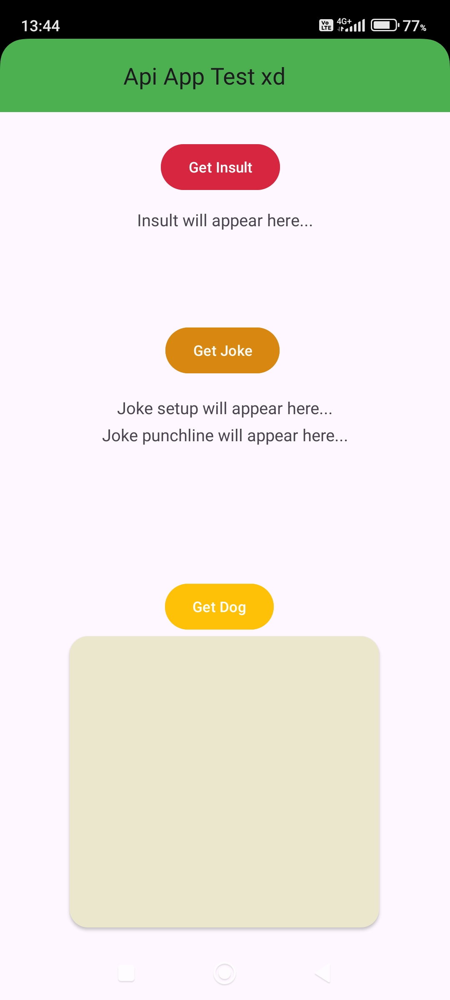

# Simple Android Api App
Very simple Android app in kotlin containing some funny buttons and api features (work in progress).

# 📱 App

This application is a simple funny app based on 3 apis:

- Joke Api: fetches 2 strings of a random joke, setup + punchline, [link here](https://official-joke-api.appspot.com/jokes/random)
- Insult Api: fetches a string with a random insult, [link here](https://evilinsult.com/generate_insult.php?lang=en&type=json)
- Dog image Api: fetches a random image of a dog, [link here](https://dog.ceo/api)

The Gui is pretty basic, i just edited the some colors, imma add a menu next and more functionalities : )

# 💻 Code
The

