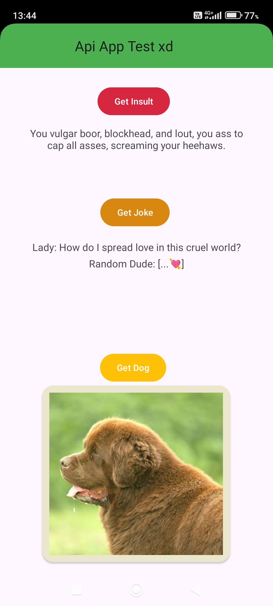

# Simple Android Api App
Very simple Android app in kotlin containing some funny buttons and api features (work in progress).


# 📱 App



This application is a simple funny app based on 3 apis:

- ```Joke Api```: fetches 2 strings of a random joke, setup + punchline, [link here](https://official-joke-api.appspot.com/jokes/random)
- ```Insult Api```: fetches a string with a random insult, [link here](https://evilinsult.com/generate_insult.php?lang=en&type=json)
- ```Dog image Api```: fetches a random image of a dog, [link here](https://dog.ceo/api)

The Gui is pretty basic, its just 3 buttons and some colors, but later imma add a menu, more functionalities, api and useless stuff : )


# 💻 Code

The code is based almost entirely on the APIs (except for the customizable parts), but in the future as i said before I'll add a menu n stuff.


### - Setup
First i change some stuff like the status bar color and the title, then i setup the 3 buttons for the 3 APIs and their functions. The way i divided each section and headers is kinda confusing, besides the Main and First/Second fragments for the default behaviour, i also created ```Retrofitclient.kt``` to handle requests and 3 files to handle the dog api.

In ```app/src/main/res/layout/``` you can find the files for the layout of the screen, its a simple colored backround with 3 centered buttons and a colored box for the image, the texts are centered as well, but i forgot to add the app icon tho.

### - Api implementation

I handled the Joke and Insult APIs in ```MainActivity``` , they are quite similar, the Dog one in 3 other files. Handling APIs in kotlin is real pain, first i built the web request, then i handled it as a string and updated the UI in the main thread with the string i just got, if no string is fetched, the button does nothing, and the error is shown in the logs. This applies for both APIs.

The dog API is quite different and more complex. First i make the request and get in a queue, while this happens, a progress bar is shown on the screen. The request will fetch a link that leads to the image of the dog, if it doesn't it will show an error on screen. The image of the dog will be then shown on screen in a colored box, and will be deleted if the button is clicked again (in order to show the progress bar loading).

<!--


--->
